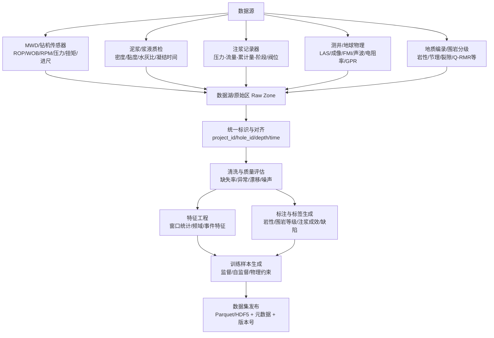
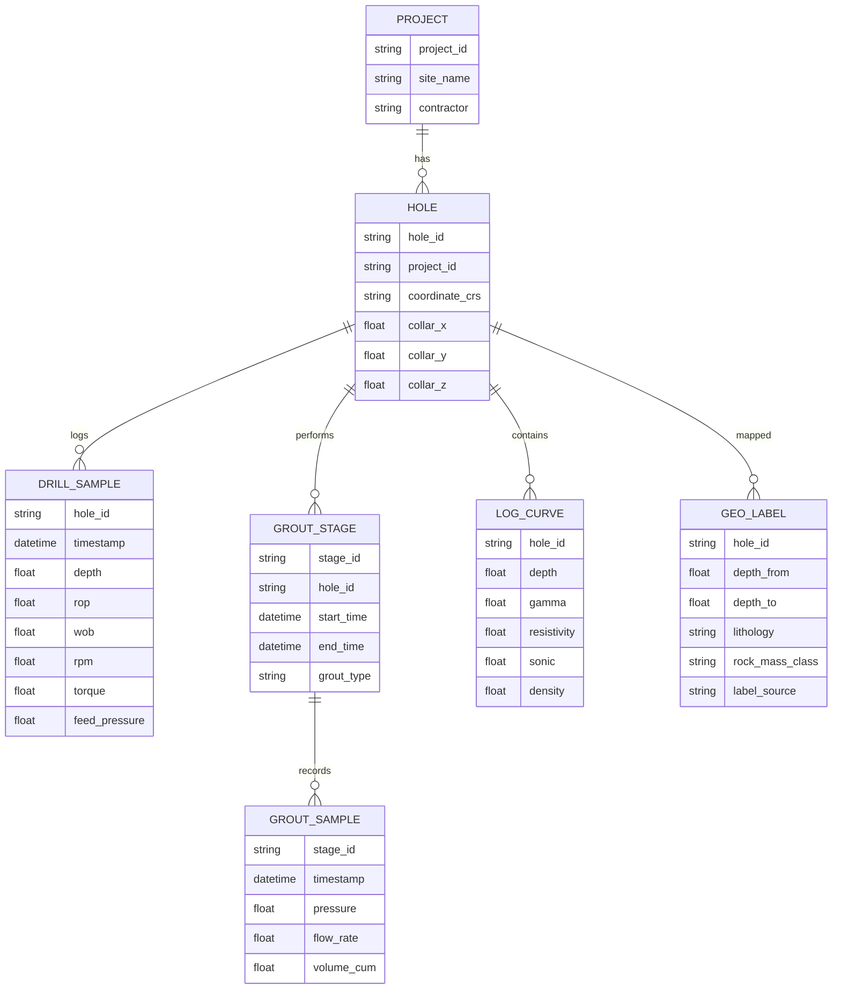

# 钻井与注浆作业深度学习训练数据集深度调研报告

## 执行摘要

本报告面向“地下工程中的钻井与注浆作业”深度学习建模需求，系统梳理了三类可用数据源：可直接下载的开源/开放数据集、论文/附录可重构的数据集（近10年为主）、以及行业/标准/项目报告中可提取的原始测量数据来源。综合可获取性、字段覆盖、标注质量与许可清晰度，当前最贴近你研究方向、且能规模化用于深度学习训练的公开数据主要集中在三条路线：以**MWD（随钻测量）—岩性/围岩等级标签**为代表的“钻进参数→地质解释”数据（挪威硬岩隧道 MWD）、以**钻井实时参数（Pason）+测井（LAS/成像测井/声波/电阻率等）**为代表的“钻井—测井一体化井场数据”（Utah FORGE）、以及以**GPR/钻孔图像/岩心图像**为代表的“地下工程无损检测与地质识别视觉数据”。其中，挪威隧道 MWD 数据集在 Zenodo 上提供了可下载记录页、包含 5205 轮爆破对应数据并给出 10 类岩性标签，同时提供 raw 与清洗/去异常版本，适合直接训练监督模型。citeturn6view0turn21view4turn21view0

针对你额外提出的“**挪威隧道 MWD（带岩性标签）我找不到**”问题：该数据集的**可进入页面**为 Zenodo 记录页（可直接下载文件），并带 DOI。注意：记录页显示许可证为 **CC BY 4.0**，但描述中同时出现“仅限科研、不可商业使用”的文字，建议在论文发表/开源模型发布/商业化场景前，按模板向作者书面确认许可边界。citeturn21view3turn21view4turn21view0

可复制访问链接（建议优先用 DOI 入口；如 Zenodo 直连受限可用 DOI 再跳转）：
```text
Zenodo 记录页（直接下载）：https://zenodo.org/records/10358374
DOI 入口（推荐）：https://doi.org/10.5281/zenodo.10358374
配套论文（Open access）：https://doi.org/10.1016/j.tust.2024.105843
作者/联系人（Zenodo 记录页显示）：Tom Frode Hansen（Norwegian Geotechnical Institute）
备用抓取（如需脚本化）：https://zenodo.org/api/records/10358374
```

## 可直接下载的开源与开放数据集

### 优先推荐数据集总览与对比表

下表优先收录**可直接下载**（或清晰可申请/可抓取）的数据集，并尽量覆盖你关心的钻进参数、泥浆/注浆过程参数、测井、地球物理（GPR/地震/电阻率）与视觉数据（隧道掌子面/钻孔/岩心图像）。若官方页面未明确某些质量指标（缺失率/噪声），表中标注为“需自行统计”，并在后文给出可复用的评估与清洗代码框架。

> 说明：表中“质量评估”是“**已知事实 + 建议检查项**”的结合；凡属于建议（如“建议统计缺失率”）不等同于来源声明。

| 名称 | 来源/链接（优先原始/官方） | 数据类型与字段示例 | 样本量/时长 | 空间/时间分辨率 | 格式 | 许可（开源类型） | 适用任务 | 质量评估（缺失/噪声/标注） | 标签/标注方法 | 元数据/地理参考 | 可复现性与重建难度 | 备注（预处理/合并建议） |
|---|---|---|---|---|---|---|---|---|---|---|---|---|
| **挪威硬岩隧道 MWD（岩性标签）** | Zenodo 记录页（可直接下载四个 CSV：raw、full、train、test）citeturn21view4turn6view0 | 表格型 MWD 数据；提供 10 类岩性标签；提供 raw 与“清洗/去异常值”的模型就绪版本citeturn6view0turn21view4turn9view0 | 覆盖 15 条隧道、5205 轮爆破（blasting rounds）；论文提及样本量约 4986（取决于抽样/划分口径）citeturn6view0turn9view0 | 与爆破轮/孔相关（按孔深/孔序列组织；分辨率需以 CSV 字段确认）citeturn6view0turn21view4 | CSV | Zenodo 页面显示 CC BY 4.0，但描述中注明“仅科研，不可商业”→需书面确认边界citeturn21view0turn21view4 | 多分类（岩性）；也可做序列预测、域泛化、转移区识别等citeturn9view0 | 已提供 raw 与 clean/outlier removed；建议复算缺失率、异常值比例、类别不均衡citeturn21view4turn6view0 | 岩性标签来自“岩体编录/映射（rock mass mappings）”并与 MWD 对应citeturn6view0 | Zenodo 提供数据集 DOl 与作者信息；项目级地理坐标是否公开需看 CSV 字段citeturn21view3turn21view0 | **高可复现**（DOI 固化、文件齐全）；若要精细到孔位/地质剖面融合，重建难度上升 | 推荐作为“MWD→岩性/围岩”基准；可与 Q 值/Q 类（需另文/另联系）扩展citeturn10view0turn21view4 |
| **Utah FORGE Well 78B-32：钻井日报+Pason+测井（含成像/声波/孔隙度/电阻率等）** | Data.gov（官方目录）+ GDR 落地页（可下载多种资源，含 1s/10s Pason CSV、LAS、原始/处理测井、日报等）citeturn27view0turn6view2 | 钻井：hole depth、bit depth、ROP、WOB、RPM 等（以 Pason CSV 为主）；测井：温度、孔隙度、密度、声波、FMI/UBI、CBL 等citeturn27view0turn6view2 | 2021-06-27 至 2021-07-31 钻进；资源总量约 11.89GB（22 files）citeturn6view2turn27view0 | Pason：1 秒与 10 秒间隔；测井按深度采样（LAS）citeturn6view2turn27view0 | CSV / ZIP / LAS / PDF | CC BY 4.0（公用许可，目录页明确标注）citeturn27view0 | 时序回归/分类（ROP、扭矩/载荷预测等）；测井曲线监督学习；多模态融合（钻井+测井） | 原始/处理并存；建议统一深度基准、处理工具专有格式（如部分 Schlumberger 文件说明）citeturn6view2turn27view0 | 多数无“监督标签”，但可用地层解释/岩性段（若提供）或自建标签 | Data.gov 提供 DOI、空间范围元数据；适合做地理参考管理citeturn27view0turn6view2 | **高可复现**（DOI + 固定资源）；多源文件多格式，工程整合中等难度 | 适合搭建“数据湖→训练集”范式：先统一 WITSML/LAS/自定义 schema 再训练citeturn5search2 |
| **Utah FORGE Well 56-32：钻井（Pason）+泥浆日志+日报+测井+轨迹等** | Data.gov（许可与资源列表清晰）+ GDR 落地页citeturn29view0turn28view1 | Pason（1s/10s）；Daily Drilling Reports；Mud Logs；轨迹（含坐标）；测井（FMI、声波、电阻率、GR、密度等），并含 XRD 结果（69 样品）citeturn29view0turn28view1 | 2021-02-07 至 2021-02-21；井深 9145 ft；多包下载（含 8.26GB Schlumberger Logs.zip 等）citeturn29view0turn28view1 | Pason：1 秒与 10 秒；测井按深度citeturn29view0turn28view1 | CSV / ZIP / LAS / PDF / XLSX | CC BY 4.0（目录页标注）citeturn29view0 | 钻井时序建模；泥浆参数-钻进状态关联；测井解释/预测；多模态融合 | 数据类型丰富但格式杂；建议先做资源清单与校验（md5/文件缺失）citeturn28view1turn29view0 | 多数为弱标签或无标签；可通过作业阶段（钻进/下套管/固井/测井）构造标签 | 目录页含 DOI 与空间信息；适合地理参考与复现归档citeturn29view0turn28view1 | **高可复现**；但跨文件对齐（时间↔深度↔轨迹）需要工程化 | 对你“钻井+注浆/固井”流程研究更友好（含 CBL 等）citeturn29view0turn28view1 |
| **DataDRILL：井场钻井变量→地层压力预测 & kick 检测** | Zenodo（可直接下载两个 CSV）citeturn6view1turn22view4 | 28 个钻井变量；两任务：Formation_Pressure_Prediction、Kick_Detection（表格监督学习）citeturn6view1turn22view4 | 每个任务“>2000 样本”；文件体量约 1.3MBciteturn6view1turn22view4 | 样本级（时间维字段需以 CSV 确认；常用于监督回归/分类） | CSV | CC BY 4.0citeturn22view0turn22view4 | 回归（地层压力）；分类/异常检测（kick） | 官方未给缺失率；建议检查类别不均衡、异常点、特征共线性 | 标签由任务定义（压力值/是否 kick）；标注依据见作者说明与配套代码（Zenodo 描述）citeturn6view1 | Zenodo DOI 固化；地理信息通常不含 | **高可复现**（DOI + CSV + 描述） | 可作为“钻井状态识别/风险预警”基线数据集 |
| **Volve Field 开放数据（最全面 NCS 数据释放之一）** | Equinor 官方数据共享页（入口）citeturn6view3 | “subsurface & operating data”全集（含生产/井/作业等大量文件；具体字段需按子目录解析）citeturn6view3 | 约 40,000 文件；生产期 2008–2016；2018 宣布公开citeturn6view3 | 多尺度（时间序列+深度序列+文档） | 多格式（多为行业标准文件；需按包解析） | 官方说明用于研究与学习（需按其条款使用）citeturn6view3 | 钻井/完井/生产时序；测井解释；多任务学习 | 超大、异构；建议做子集化（先选 drilling、mud、well log、trajectory） | 多数无统一标签；可用事件日志/地层解释构造弱标签 | 元数据丰富但结构复杂 | **中等复现**（来源稳定但工程整合成本高） | 适合做“工业级数据工程能力”训练与多模态研究 |
| **FORCE 2020 测井岩相/岩性竞赛数据（118 口井）** | Zenodo（含 LAS zip + scoring matrix 等）citeturn6view5turn25view2 | 测井曲线（LAS）；手工岩相/岩性解释标签；并说明日志“部分清洗与去尖峰”citeturn6view5turn25view2 | 118 wells；zip 约 170MB；下载量较高citeturn6view5turn25view2 | 深度分辨率随测井采样；井级空间 | LAS / XLSX | Zenodo 显示 CC BY 4.0；同时注明原始数据来自挪威政府、受 NOLD 2.0 许可约束（需注意二次分发与商用）citeturn25view0turn25view2 | 多分类（岩相）；序列分类；半监督/迁移学习 | 已“slightly cleaned & partially despiked”；标签由地学专家手工解释citeturn6view5turn25view2 | 有标签（竞赛标签），标注来源清楚citeturn6view5 | 井位/地层信息在配套表格中；地理坐标需看文件 | **高可复现**（DOI + 文件齐全） | 强烈建议作为“测井曲线分类”标准基线 |
| **Netherlands F3 地震解释数据（切片+mask+tiles 等）** | Zenodo 解释数据集（含 crosslines/inlines、horizons、masks、tiles）citeturn6view6turn26view4 | 地震切片与语义分割标签（多类）；给出 classes、slices、tiles 配置等citeturn26view4turn6view6 | Crosslines/ Inlines 各约 94k 记录级别；文件约 1.7GBciteturn26view4 | 体数据切片（空间分辨率由原始地震设置决定） | zip / tar.gz / png 等citeturn26view4 | CC BY 4.0citeturn26view0 | 分割/分类；地质体识别；自监督表征学习 | 提供 mask 与例图；噪声参数在配置中出现（需按文档理解）citeturn26view4 | 像素级标签（地震相/层位间隔） | 通常含体数据索引；地理参照需看数据包说明 | **高可复现**（DOI + 文件齐） | 若你做“地质结构/裂隙带识别”，可借鉴其标注范式 |
| **Penobscot 地震解释数据（HDF5 + horizons + notebook）** | Zenodo（dataset.h5、how-to-read.ipynb 等）citeturn6view7turn26view5 | HDF5 中包含标注切片；并给出 how-to-read notebook；官方描述“>100,000 labeled images”citeturn6view7turn26view5 | 多切片、多类；dataset.h5 ≈ 2.3GBciteturn26view5 | 体数据切片 | HDF5 / zip / ipynbciteturn26view5 | CC BY 4.0citeturn26view1 | 分割/分类 | 标签来自地震重新解释；建议检查类分布与切片抽样偏差 | 有标签 | 地理参照通常为勘探区块坐标系（需读元数据） | **高可复现** | 可用作“多尺度体数据→语义分割”基线 |
| **GPR DATASET（广州大学团队：隧道衬砌/管线/钢筋混凝土等）** | Zenodo（3.8GB zip；含联系方式）citeturn24view0turn6view4 | 原始 GPR 数据文件为 IDS GeoRadar 的 .dt 格式；覆盖隧道衬砌、管线、钢筋混凝土等多场景citeturn24view3turn6view4 | Data Set.zip 约 3.8GBciteturn24view0 | 多频段/多场景（需读包内说明） | .dt（raw）+ zipciteturn24view3 | CC BY 4.0citeturn24view0 | 目标检测/分割（B-scan 图像化后）；去噪；反演 | Zenodo 提供下载与 md5；“标注/验证”存在但需在包内确认citeturn24view0 | 标注方式需看随包文档；页面提示团队“annotation/validation”参与citeturn24view0 | 给出团队网站与邮箱；地理参考需看包内 | **高可复现**（DOI + 文件） | 与“注浆质量/缺陷识别（GPR）”方向天然契合 |
| **Tunnel Excavation Face Segmentation Dataset（隧道掌子面分割）** | Zenodo（ExcavationRockFace.zip 1.3GB）citeturn17view1 | 掌子面图像 + 分割标注（具体类别需解压确认）citeturn17view1 | zip 约 1.3GB；采集日期标注为 2020-03-06citeturn17view1 | 图像级 | zip（图像+mask）citeturn17view1 | CC BY 4.0citeturn17view1 | 语义分割/实例分割 | 官方未给缺失率；建议校验 mask 完整性与类别一致性 | 有分割标签 | 元数据较少（以 Zenodo 字段为主） | **高可复现**（DOI + 文件） | 可作为“掌子面岩性/构造识别”入门数据 |
| **DCID 岩心图像数据集（岩性识别，公开基准）** | GitHub（数据说明、作者邮箱、许可）+ 论文（数据构建与基线）citeturn6view9turn9view5 | RGB 岩心图像；GitHub 提供 DCID-7（7 类×5000）与 DCID-35（35 类×1000），分辨率 512×512；论文指出 DCID 总计 98,000 张、35 类citeturn6view9turn9view5 | GitHub 子集各 35,000 张；论文总量 98,000 张citeturn6view9turn9view5 | 图像级 | 图像文件（按仓库实际提供） | CC BY-NC 4.0（非商业）citeturn6view9turn9view5 | 图像分类；鲁棒性评估（RWDA） | 类别明确；建议检查类间相似度与“同井段泄漏” | 强标签（岩性类别）；并提供增强方案说明citeturn6view9 | 通常不含地理坐标（以分类为主） | **高可复现**（仓库+DOI/论文） | 与“钻探取芯→岩性识别→注浆决策”链条高度相关 |
| **UCI Concrete Compressive Strength（材料配比→强度）** | UCI 官方数据页（含 DOI 与许可）citeturn23view1 | 8 个输入（cement、water、矿粉等）+ 1 输出（抗压强度）；无缺失值citeturn23view1 | 1030 条样本；9 个变量（含目标）citeturn23view1 | 样本级 | xls | CC BY 4.0（UCI 明确标注）citeturn23view1 | 回归；可做不确定性估计 | 无缺失值（官方声明）；噪声需做鲁棒回归检查citeturn23view1 | 强标签（强度） | 元数据完整（UCI 页面）citeturn23view1 | **高可复现** | 可迁移到“浆液配比→黏度/凝结/强度”等材料学习（需替换目标） |
| **国家地球系统科学数据中心：钻孔成像测井解译数据（雄安等）** | geodata.cn 数据集详情页（含 DOI、数据量与联系方式）citeturn8search2 | 成像测井数据与裂缝解释原始数据（由 Techlog WBI 模块解译），适合裂隙识别/统计学习citeturn8search2 | 数据量约 695.22MB；包含多个钻孔citeturn8search2 | 深度分辨率随测井采样 | 需按平台下单/下载样例（具体文件类型以附件为准）citeturn8search1turn8search2 | 平台声明“仅限科研使用”、禁止再分发/销售，需按平台规则申请citeturn8search1turn8search0 | 裂隙检测/分类；成像测井语义分割；地质参数反演 | 质量依赖测井工具与处理流程；可参考行业规范做深度匹配、失效电扣插值等citeturn8search5 | 标签（裂缝解释）存在；具体标注字段需下载确认 | DOI、联系人、空间位置等元数据较完整citeturn8search2 | **可复现中等**（访问受规则约束；不可随意再分发） | 强烈建议用于“裂隙-渗透性-注浆加固”建模，但要严格合规使用citeturn8search0 |

### 挪威隧道 MWD 数据集的“找不到”常见原因与备用获取途径

很多人“找不到”的原因通常是：用关键词只搜论文、没直接搜 Zenodo 记录；或所在网络无法直连 Zenodo。该数据集 Zenodo 页明确提供可下载文件列表与 MD5，并给出联系人。citeturn21view4turn21view3

备用获取路径建议按优先级：
1) **DOI 入口**（更稳定）：使用 `https://doi.org/10.5281/zenodo.10358374` 跳转到镜像/主站（上文已给出）。citeturn21view0
2) **Zenodo API 自动化下载**：用 `https://zenodo.org/api/records/10358374` 获取文件清单后脚本批量下载（下文给出 Python 示例）。
3) **作者联系**：Zenodo 记录页标注联系人为 Tom Frode Hansen（NGI）。citeturn21view3
4) **配套论文反查路径**：该数据用于 TUST 论文（开放获取）`10.1016/j.tust.2024.105843`，可从论文“Data/Code availability”或作者信息反向找到数据入口。citeturn9view0turn21view3

> 许可注意：Zenodo 的“CC BY 4.0”与描述中的“仅限研究、不可商业”存在潜在冲突，应以作者书面确认/项目条款为准。citeturn21view0turn21view4

## 论文或附录中可重构的数据集候选论文清单

本节给出**至少10篇**近10年内（或仍具工程参考价值）的候选论文，覆盖 MWD 岩性/围岩等级预测、隧道掌子面/衬砌缺陷识别、GPR 与注浆层厚度反演、钻孔成像与结构面识别、岩心图像岩性识别、以及注浆在裂隙网络中的流动建模。每篇附“可提取字段”和“重建步骤”，并明确数据获取方式：附录/补充文件/仓库/作者联系/可复现实验生成。

| 论文（近10年为主） | DOI / 标识 | 数据获取方式 | 可提取字段（面向你方向的可用子集） | 重建步骤（可操作） | 重建难度与风险 |
|---|---|---|---|---|---|
| Predicting rock type from MWD tunnel data using a reproducible ML-modelling process (TUST, 2024) | 10.1016/j.tust.2024.105843citeturn9view0 | **Zenodo 公开下载**（MWD+岩性标签）citeturn21view3turn21view4 | 48 个 MWD 特征（论文提及）；10 类岩性；可构造“提前 3–6m 预测”等标签窗口citeturn9view0turn6view0 | 下载 CSV → 统一字段/单位 → 复现作者 train/test 划分（已有）→ 评估类别不平衡与过渡带性能 | 低风险；主要风险是许可边界需确认citeturn21view4turn21view0 |
| A comparative study on machine learning approaches for rock mass classification using drilling data (2024) | 10.1016/j.acags.2024.100199citeturn10view0 | “数据与代码可按请求提供”citeturn9view1 | Q-class/Q-value（围岩质量指标）、MWD 统计特征、按爆破轮生成的 MWD 图像（CNN 输入）citeturn9view1 | 先用公开 MWD 岩性数据做预实验 → 邮件请求 Q 标注/代码 → 若只给流程，可按文中“孔→轮→图像”的构造方法重现 | 中等；若作者不共享 Q 标注则难以完全复现 |
| Shield tunnel grouting layer estimation using sliding window probabilistic inversion of GPR data (TUST, 2021) | 10.1016/j.tust.2021.103913citeturn19search3turn16search0 | 论文未见公开数据入口（需作者联系/自建） | GPR 波形/介电常数与电导率/注浆层厚度（目标）；可为“注浆质量评估/厚度反演”提供任务定义citeturn16search0 | 若作者不提供原始 GPR：按论文描述构建合成数据（仿真）→ 按滑窗提取特征 → MCMC/贝叶斯推断或改为 PINN/深度回归 | 中高；但任务定义对你“注浆层评估”非常直接 |
| Defect segmentation: Mapping tunnel lining internal defects with ground penetrating radar data using a CNN (CBM, 2022) | 10.1016/j.conbuildmat.2021.125658citeturn15view0 | 作者版本 PDF 可获取；数据可通过“合成介电模型→合成 GPR”重建citeturn15view0 | 介电常数模型、缺陷类别（空洞/裂缝/渗水等）、GPR B-scan 分割标签（语义分割任务）citeturn15view0 | 依论文给定材料/缺陷参数范围与表格 → 用 gprMax/自编 FDTD 生成合成数据 → 生成像素级 label（“模型即标签”）→ 少量实测数据做域自适应 | 中等；优势是你可完全控制“注浆类缺陷”的参数空间 |
| Arbitrarily-oriented tunnel lining defects detection from GPR images using deep CNNs (AutCon, 2022) | 10.1016/j.autcon.2021.104044citeturn13search17 | 论文通常基于“合成+模型试验+现场”数据；需作者联系或自建 | 任意方向缺陷目标检测框（旋转框）、合成 GPR 数据生成方法、评价指标（mAP 等）citeturn12view1turn13search17 | 复现其合成数据生成 → 用旋转框标注（依据缺陷几何）→ 训练旋转检测器（Rotated R-CNN/YOLO-OBB） | 中等；若只做合成域，迁移到现场需域适配 |
| Automatic recognition of tunnel lining elements from GPR images using deep CNNs with data augmentation (AutCon, 2021) | 10.1016/j.autcon.2021.103830citeturn13search11 | 多为作者自建数据；可联系作者或按论文方法重采/重建 | 钢拱架/空洞/初期支护等“衬砌元素”目标检测或分割标签 | 若无原始数据：先用公开 GPR DATASET（Zenodo）替代做预训练citeturn24view0 → 再按论文策略增强/微调 | 中等；关键在“工程场景差异” |
| Context-aware semantic segmentation network for tunnel face feature identification (AutCon, 2024) | 10.1016/j.autcon.2024.105560citeturn10view1 | 论文称构建 7792 张人工标注掌子面数据集，但未见公开入口（需作者联系）citeturn9view2 | 掌子面结构/岩体特征分割标签（可服务“开挖面地质识别”）citeturn9view2 | 联系作者索取原始图像+mask → 若不给，参照其“裁剪到 448×448 + 增强”的流程自建采集方案 | 中等偏高；数据不可得时只能复现方法不复现数据 |
| Lightweight deep learning model for identifying tunnel lining defects based on GPR data (AutCon, 2024) | 10.1016/j.autcon.2024.105506citeturn10view2 | 论文数据通常为工程项目数据；可用公开 GPR DATASET 替代做基线citeturn24view0 | 雷达图像→空洞/脱空分类或检测；可做噪声鲁棒性研究citeturn10view2 | 公开数据预训练 → 加噪增强模拟“隧道附属物干扰” → 对齐论文指标（accuracy/precision 等）citeturn10view2 | 中等；受限于原场景噪声与标签定义 |
| A borehole image dataset for the intelligent identification of structural planes (2025) | 10.1016/j.rineng.2025.106419citeturn10view3 | “数据可向通讯作者请求”citeturn9view4 | BSP700 钻孔成像；包含**多边形分割**与**矩形框检测**两套标注方案citeturn10view3turn9view4 | 联系作者索取数据 → 建立统一标注格式（COCO/YOLO/Mask）→ 复现实验（DeepLabV3+、YOLOv8 等）citeturn10view3 | 中等；若仅“按请求提供”可能需签署用途说明 |
| PLOS ONE：U²-Net 钻孔图像结构面分割（2024） | 10.1371/journal.pone.0299471citeturn32view0 | **Supporting information 直接提供 ZIP**（S1/S2 文件）citeturn32view1 | 1013 张钻孔图像；LabelMe 多段线标注结构面区域；含增强策略citeturn6view8turn32view3 | 下载 S1/S2 ZIP → 恢复原图+label → 转 COCO/PNG mask → 复现训练/验证/测试划分（60/20/20）citeturn32view3 | 低风险；开源许可清晰（CC BY）citeturn32view0 |
| DCID：A large-scale, high-quality dataset for lithology identification (Petroleum Science, 2025) | 10.1016/j.petsci.2025.04.013citeturn9view5 | GitHub 公开数据 + 论文基线citeturn6view9turn9view5 | 35 岩性类别，图像 512×512；论文给出多模型基线（ResNet/ViT 等）citeturn9view5turn6view9 | 下载数据 → 按官方 8:2 划分 → 复现基线 → 做跨项目泛化（新井段/新光照） | 低-中；注意 CC BY-NC（限制商用）citeturn6view9 |
| 注浆裂隙网络数值模型（Computers and Geotechnics, 2024） | 10.1016/j.compgeo.2024.106698citeturn10view4 | 数据不一定公开；但可用其模型/实验流程生成“仿真数据集” | 裂隙网络参数、浆液时变黏度、压力/流量/扩散前沿等（适合 PINN/反演）citeturn10view4 | 依据论文建立裂隙网络与耦合模型 → 批量扫参生成（输入：注浆工况；输出：扩散范围/渗透性变化）→ 形成监督/物理约束数据集 | 中高；但非常适合你做“物理建模+深度学习融合” |

## 行业、标准与项目报告中的可提取原始测量数据来源

现实工程中，“注浆压力-流量-浆液性质-孔口/孔内压力-地层渗透性变化”等关键变量往往被设备记录在控制系统/施工报表/质检记录中，但公开成体系共享较少。下面给出**可作为数据字段标准化依据**与**可提取原始测量字段的报告/规范/平台**，便于你在自建数据集时对齐字段体系、统一格式并提升可复现性。

| 来源/规范/报告（原始/官方优先） | 可提取/对齐的原始字段线索 | 典型输出格式与获取方式 | 许可/使用注意 | 与你研究的关联方式 |
|---|---|---|---|---|
| **BAUER Grouting 系统资料（示例：Grouting 报告字段）** | “Grouting report”自动记录：位置、日期、配比类型、注浆量、压力、泵速；“Fresh grout testing report”：取样信息、水灰比、比重、Marsh 黏度、沉降比；“Laboratory test report”：黏聚力、表观黏度、凝结时间、UCS 等citeturn5search1 | 多为项目报表/设备导出（各公司实现不同）；用于定义你的“注浆字段字典” | 设备/项目数据通常涉商业秘密；公开前需脱敏与授权 | 直接用于设计“注浆过程时序数据集 schema”和“质检标签（合格/不合格/返工）” |
| **Epiroc 注浆系统技术规格（含记录系统线索）** | 说明其注浆系统包含 Cemix mixing、Pumpac pump、以及 Logac recorder（记录）等组件，提示“可记录/可数字化”链条存在citeturn5search0turn5search8 | 厂商技术规格 PDF；可作为设备侧字段清单的“参考上限” | 厂商文档可引用但不等同于你可公开项目数据 | 帮你把“孔→浆→泵→记录器”的数据流结构化（见下文 ER 图） |
| **WITSML（Energistics）钻井/测井数据交换标准** | WITSML 用于 wells、wellbores、time/depth logs、trajectory 等对象的数据交换，覆盖 drilling、logging、mud logging 等citeturn5search2turn5search25 | XML/ETP 等；适合你将多源井场数据统一成可训练数据湖 | 标准本身用于互操作；具体数据仍需许可 | 作为“钻井参数字段命名规范/数据结构”参考，降低你自建集与工业数据对接成本 |
| **SEG-Y rev 1 地震数据标准（SEG 官方 PDF）** | rev 1 将文本头等结构更规范化，利于机器可读存储与交换citeturn5search3 | SEG-Y（.sgy/.segy）；大量地震数据以此交换 | 数据本身可能有版权/坐标限制 | 你若做“注浆前后地震/超声/电阻率”对比，可用 SEG-Y 统一归档 |
| **ASTM D6910/D6910M（Marsh 漏斗黏度试验）** | ASTM 指出 Marsh 漏斗黏度可用于施工浆液现场质控，识别黏度变化并调整配浆/处理流程citeturn5search16 | 标准条文（付费）；但字段“漏斗时间/温度/配比”等可据此规范化记录 | 标准文本版权；引用要合规 | 将“浆液流变/配比”纳入你的注浆数据集标签体系（如：可注性/离析风险） |
| **国家地球系统科学数据中心使用规则** | 共享平台数据通常只授予有限非排他使用权；禁止转让/再分发；用途变更需重新申请，并要求成果注明来源citeturn8search0turn8search3 | 平台在线申请/下单下载 | 明确限制再分发与用途 | 若你从该平台获取测井/裂隙解释数据，训练模型与公开权重需谨慎处理（避免二次分发风险） |
| **IODP（国际大洋发现计划）数据与样品访问** | IODP 官方说明：数据可通过各科学执行机构访问，井下测井数据可通过 LDEO 数据库；样品/数据申请通过 SaDR/SDRM；并要求成果致谢 IODPciteturn20search0turn20search2turn20search12 | 多门户（JRSO/ESO/MarE3/LDEO/PANGAEA 等）citeturn20search0turn20search5 | 有政策与保护期（moratorium）；需遵守 Sample/Data/Obligations Policyciteturn20search4turn20search2 | 若你需要“电阻率/声波/密度/成像测井”与岩芯物性，可在 IODP 找到大量公开数据做预训练 |
| **NOAA International Ocean Drilling Data Archive** | NOAA 说明其提供 IODP 等钻探数据访问，链接通常提供建议引用且多数带 DOI，并提示数据可能更新需记录访问日期citeturn20search21 | 在线数据访问与 DOI 引用 | 注意版本/访问日期 | 适合系统化爬取“钻探/测井/物性”并做大模型预训练 |

## 自建“钻井—注浆”自定义数据集的工程化流程与 Python 代码建议

### 数据结构与处理流程示意（mermaid）

下面给出一个适合你研究的“孔→钻进→注浆→评价”的数据工程流程图；核心思想是：把**钻进时序**、**注浆时序**、**地质/测井解释（深度域）**与**空间信息（孔轨迹/断面）**统一到同一个可追溯 schema，再根据任务生成训练样本（窗口化、对齐、标注）。



与流程对应的一个推荐实体关系（ER）骨架如下，可直接转成数据库表或 Parquet 分区字段，以支撑“孔级—阶段级—采样级”检索：




## 推荐的深度学习任务、基线模型与评价指标

结合你“地下工程钻井+注浆”的交叉方向、以及上文公开数据的可得性，建议优先选择**可规模化训练且能迁移到工程现场**的任务组合：先用公开数据做预训练/基线，再用你自己项目小样本做微调或域适配。

### 钻井/MWD（表格与时序）

挪威 MWD 数据最适合做“MWD→岩性多分类”，论文中明确以 LightGBM 等方法实现高分数，并强调可复现流程。citeturn9view0turn21view4
建议基线从“强基线”到“深度学习”逐级建立：

1) **多分类（岩性/围岩等级）**
输入：`[window, n_features]`（例如 5–60 个采样点窗口；特征≈48）citeturn9view0
输出：`n_classes`（如 10 类岩性）citeturn6view0
指标：Balanced Accuracy / Macro-F1 / 混淆矩阵（尤其关注相近岩性、过渡带）citeturn9view0
基线模型：LightGBM / XGBoost（强基线）、TCN、1D-CNN、Transformer Encoder、InceptionTime。

2) **钻井异常/风险预警（kick/漏失/卡钻倾向）**
输入：Pason/WITSML 时序（Utah FORGE）或 DataDRILL 变量citeturn6view2turn6view1
输出：二分类/多分类或时间到报警（time-to-event）
指标：AUROC、AUPRC、F1、平均提前量（lead time）
基线模型：TCN、GRU/LSTM、Temporal Fusion Transformer、异常检测自编码器/对比学习。

### 注浆与无损检测（GPR/图像）

1) **GPR B-scan 缺陷检测/分割（注浆空洞、脱空、渗水等）**
可直接使用公开 GPR DATASET（.dt raw）进行图像化后训练。citeturn24view3turn24view0
输入：B-scan 转图像（或频谱/时频图）
输出：mask（分割）或 bbox（检测）
指标：mIoU/Dice（分割）、mAP（检测）、在噪声场景下的鲁棒性指标。citeturn10view2

2) **注浆层厚度反演（GPR→厚度/介电参数）**
目标论文给出“厚度+介电常数+电导率”的反演任务定义，可用贝叶斯方法或深度回归替代。citeturn16search0turn19search3
输入：滑窗 GPR 波形特征/原始序列
输出：厚度（回归）+不确定性
指标：RMSE/MAE + 覆盖率（calibration）

3) **掌子面/钻孔/岩心图像识别**
掌子面分割（Zenodo 10.5281/zenodo.10261105）可做语义分割；citeturn17view1
钻孔图像结构面分割（PLOS zip）可做分割/检测；citeturn32view1turn32view3
岩心图像 DCID 可做岩性分类/鲁棒性评估。citeturn6view9turn9view5

### 参考实现链接（便于快速落地）

（按你的需求给出“可直接复用”的开源实现入口；为遵守链接展示规范，统一放在代码块中）
```text
PyTorch 时序分类强基线（InceptionTime）：https://github.com/timeseriesAI/tsai
TCN 参考实现：https://github.com/locuslab/TCN
PyTorch 语义分割工具箱（mmsegmentation）：https://github.com/open-mmlab/mmsegmentation
PyTorch 检测/分割工具箱（mmdetection）：https://github.com/open-mmlab/mmdetection
Ultralytics YOLO（含分割）：https://github.com/ultralytics/ultralytics
读取 SEG-Y（segyio）：https://github.com/equinor/segyio
读取 LAS（lasio）：https://github.com/kinverarity1/lasio
```

## 数据许可、伦理与作者联系模板

### 许可与合规要点（你最容易踩坑的地方）

1) **同一数据源可能存在“平台许可 vs 数据描述条款”不一致**。例如挪威 MWD 数据集 Zenodo 页显示 CC BY 4.0，但描述中出现“仅科研、不可商业”的限制文字，应在发表/开源/转用前书面确认。citeturn21view0turn21view4

2) **中国国家级数据平台常见限制是“仅科研使用 + 不得再分发/转让/用于对外数据库/产品”**，且用途变更需重新申请；成果需按规范引用并提交可公开成果。citeturn8search0turn8search3

3) **IODP 等国际计划对数据/样品有政策、可能存在保护期（moratorium）与引用/致谢义务**，且不同阶段/平台有不同门户；务必按其政策执行并在成果中致谢。citeturn20search4turn20search12turn20search0

4) **模型权重发布也可能构成“间接再分发”风险**：当训练数据禁止再分发时，公开权重/可逆重建风险（会员推断）需评估；至少应提供“训练数据来源与许可说明”，必要时仅发布推理代码不发布权重。

### 向作者索取数据/澄清许可的中文邮件模板

> 适用场景：论文写“Data available on request”、或数据许可边界不清晰（例如“CC BY”与“research-only”同时出现）、或你希望获取更细粒度标签（如 Q 值、注浆阶段标注、孔位坐标等）。

```text
主题：关于论文/数据集《[论文标题]》（DOI: [DOI]）数据获取与使用许可确认的请求

尊敬的[作者姓名]老师/研究团队 您好：

我叫刘建宇，目前是[学校/学院]土木工程与人工智能交叉方向的研究生，研究主题为地下工程中的钻井与注浆作业数据驱动建模。
我阅读了您团队的论文/数据集：
- 论文：[完整引用]（DOI: [DOI]）
- 数据集：[数据集名称/记录页]（如：Zenodo Record: [链接或record id]）

我希望在科研用途下使用该数据开展以下研究：
1) [任务1：例如 MWD→岩性/围岩等级预测；注浆压力-流量曲线异常检测；GPR 缺陷分割等]
2) [任务2：例如 多模态融合、域泛化、物理约束学习等]
预期成果形式为：学术论文/毕业论文/开源代码（若涉及开源，我会严格遵守许可条款，仅在允许时公开模型权重与衍生数据）。

为确保合规使用，我想请教并申请：
A. 数据获取：是否可以提供/授权我获取[具体数据文件、标注、元数据]？（例如：Q-value/Q-class、孔位/里程信息、注浆阶段标签、原始传感器采样频率说明等）
B. 使用许可：我注意到数据集页面标注为[例如 CC BY 4.0]，同时描述中提到[例如 “仅限科研、不可商业”]。请问最终以哪一条为准？是否允许：
   - 在学术论文中使用并发表结果？
   - 在非商业前提下公开训练代码与模型权重？
   - 在论文补充材料中公开少量样本示例（脱敏）？
C. 引用方式：您建议我在论文/致谢中如何引用数据与论文（是否有指定格式）？

我愿意签署数据使用协议（如有）、承诺不对外再分发原始数据，并在成果中按要求引用与致谢。
如方便，我也可以提供我的研究计划简述与数据管理方案供您评估。

感谢您在百忙之中阅读此邮件，期待您的回复！
祝好！

刘建宇
[学校/学院]
[城市, 国家]
邮箱：jianyu.liu436@gmail.com
```

### 你可以如何把“公开数据”安全地用于论文与开源

在合规前提下，一个实用策略是：**公开数据用于预训练/基线与方法论验证**（例如挪威 MWD、Utah FORGE、DCID、公开 GPR），而你的工程项目数据用于微调/验证，并在开源时只发布“代码+配置+不可逆统计特征”（如归一化参数、匿名化后的分布统计），避免泄露或构成再分发。对于国家平台数据，尤其要遵守“不再分发”的条款与用途一致性要求。citeturn8search0turn8search3